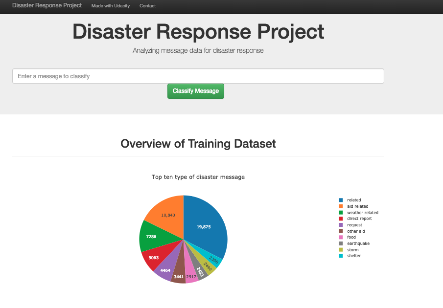

# Disaster Response Pipeline Project

The Disaster response pipeline project was one of the projects I did for Udacity's Data Science Nanodegree program. The aim of the project was to build a Natural Language Processing (NLP) pipeline that:

* Extract, Transforms and load the disaster response dataset
* Creating meaningful features from the data using a 'bag of words' approach
* Training a model on new data by performing grid search using a Multi-layer perceptron (MLP) algorithm
* Saving the model for classifying new messages

I made use of disaster data from [Figure Eight](https://www.figure-eight.com/) to build a model for an API that classifies disaster messages.




## Installation
### Dependencies

Disaster-response-pipeline was built using the following dependencies:
* Python 3.6.7
* Flask 1.0.2
* nltk 3.3
* pandas 0.22.0
* plotly 3.6.1
* scikit-learn 0.19.1
* SQLAlchemy 1.2.11

The requirements file can be used to install the dependencies, by running:

```
pip install -r requirements.txt
```

### User installation
Clone the github repository and install all the dependencies.

```
git clone git@github.com:Rmostert/Disaster-response-pipeline.git
```

## Instructions:
1. Run the following commands in the project's root directory to set up your database and model.

    - To run ETL pipeline that cleans data and stores in database
        `python data/process_data.py data/disaster_messages.csv data/disaster_categories.csv data/DisasterResponse.db`

        The first, second and third arguments are the location of the process_data.py, the disaster messages and categories files respectively. The fourth argument is the name and location of the database that you would like to create containing the cleaned data that will be used to train your model.

    - To run ML pipeline that trains classifier and saves
        `python models/train_classifier.py data/DisasterResponse.db models/classifier.pkl`

        Here the second argument is the name and location of the database containing the training/test data and the third argument the location where you want to store your saved model.

2. Run the following command in the app's directory to run your web app.
    `python run.py`

3. Go to http://0.0.0.0:3001/
